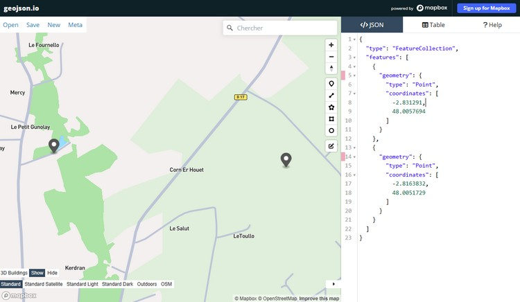
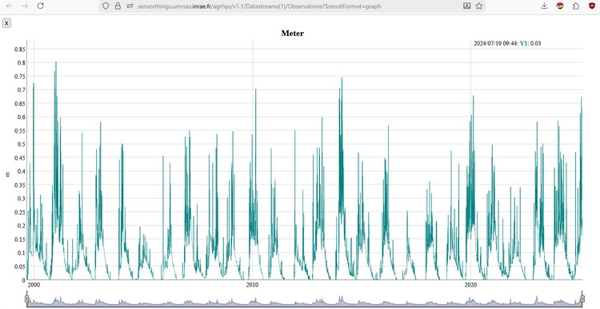
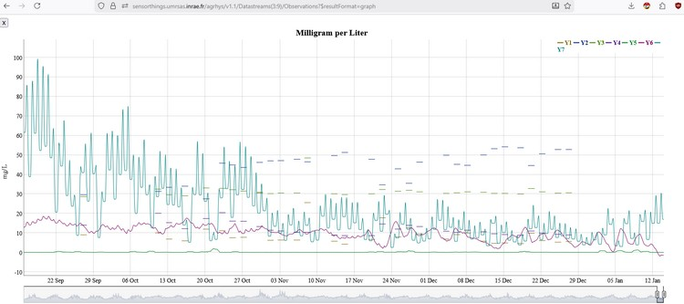
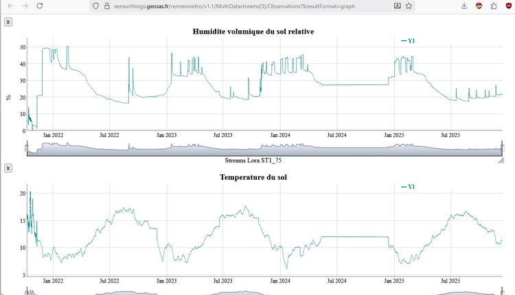
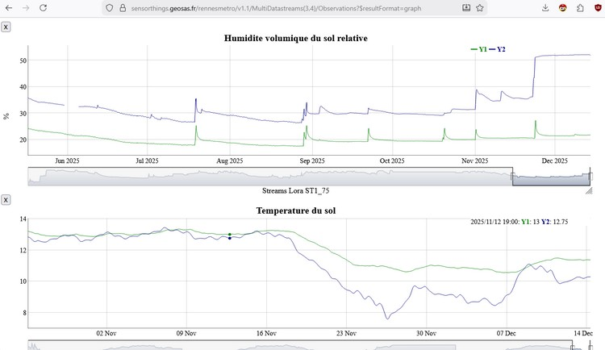

# [STEAN](./index.md)

- [format JSON](#json)
- [format CSV](#csv)
- [format txt](#txt)
- [format dataArray](#dataarray)
- [format GeoJSON](#geojson)
- [format sql](#sql)
- [format graph ](#graph )
- [format graphDatas ](#graphdatas )

## <a name="json"></a>json :

###  https://sensorthings.umrsas.inrae.fr/test/v1.1/Things 

Le format natif par default de l'API
```JSON
{
  "@iot.count": 2,
  "value": [
    {
      "@iot.selfLink": "https://sensorthings.umrsas.inrae.fr/test/v1.1/Things(1)",
      "@iot.id": 1,
      "name": "Outlet Exutoire",
      "description": "Exutoire du bassin versant de Kervidy",
      "properties": {
        "image": ""
      },
      "Locations@iot.navigationLink": "https://sensorthings.umrsas.inrae.fr/test/v1.1/Things(1)/Locations",
      "HistoricalLocations@iot.navigationLink": "https://sensorthings.umrsas.inrae.fr/test/v1.1/Things(1)/HistoricalLocations",
      "Datastreams@iot.navigationLink": "https://sensorthings.umrsas.inrae.fr/test/v1.1/Things(1)/Datastreams",
      "MultiDatastreams@iot.navigationLink": "https://sensorthings.umrsas.inrae.fr/v1.1/test/Things(1)/MultiDatastreams"
    },
    {
      "@iot.selfLink": "https://sensorthings.umrsas.inrae.fr/test/v1.1/Things(2)",
      "@iot.id": 2,
      "name": "Station Meteo Toullo",
      "description": "Station meteorologique du bassin versant de Naizin",
      "properties": {
        "image": ""
      },
      "Locations@iot.navigationLink": "https://sensorthings.umrsas.inrae.fr/test/v1.1/Things(2)/Locations",
      "HistoricalLocations@iot.navigationLink": "https://sensorthings.umrsas.inrae.fr/v1.1/test/Things(2)/HistoricalLocations",
      "Datastreams@iot.navigationLink": "https://sensorthings.umrsas.inrae.fr/test/v1.1/Things(2)/Datastreams",
      "MultiDatastreams@iot.navigationLink": "https://sensorthings.umrsas.inrae.fr/test/v1.1/Things(2)/MultiDatastreams"
    }
  ]
}
```

## <a name="csv"></a>csv :

Le format CSV qui dans stean est totalement gérér c'est a dire qu'un appel de type :

https://sensorthings.umrsas.inrae.fr/test/v1.1/Things?$resultFormat=csv

```CSV
@iot.id;name;description;properties
1;Outlet Exutoire;Exutoire du bassin versant de Kervidy;"{""image"": """"}"
2;Station Meteo Toullo;Station meteorologique du bassin versant de Naizin;"{""image"": """"}"
```

https://sensorthings.umrsas.inrae.fr/test/v1.1/Things(1)/Locations?$resultFormat=csv

https://sensorthings.umrsas.inrae.fr/test/v1.1/Things(1)/Locations?$resultFormat=csv

sont possible

## <a name="txt"></a>txt :

https://sensorthings.umrsas.inrae.fr/test/v1.1/Things?$resultFormat=txt renvoi le resultat au format texte

## <a name="dataarray"></a>dataarray :

https://sensorthings.umrsas.inrae.fr/test/v1.1/Things?$resultFormat=dataArray renvoi le resultat au format dataArray et pas seulement pour les observations.

```JSON
{
  "@iot.count": 2,
  "value": [
    {
      "components": [
        "description",
        "@iot.id",
        "name",
        "properties"
      ],
      "dataArray": [
        [
          "Exutoire du bassin versant de Kervidy",
          1,
          "Outlet Exutoire",
          "{\"image\": \"\"}"
        ],
        [
          "Station meteorologique du bassin versant de Naizin",
          2,
          "Station Meteo Toullo",
          "{\"image\": \"\"}"
        ]
      ]
    }
  ]
}
```

## <a name="geojson"></a>geojson :

###  https://sensorthings.umrsas.inrae.fr/test/v1.1/Locations?$resultFormat=GeoJSON

Si l'entité selectionné contiens une proprieté GeoJSON le resultat retourne toutes le valeurs GeoJSON

```JSON
{
  "type": "FeatureCollection",
  "features": [
    {
      "geometry": {
        "type": "Point",
        "coordinates": [
          -2.831291,
          48.0057694
        ]
      }
    },
    {
      "geometry": {
        "type": "Point",
        "coordinates": [
          -2.8163832,
          48.0051729
        ]
      }
    }
  ]
}
```

si vous le faites dans le Query vous avez une icone qui apparait permetant d'ouvrir les points dans geojson.io permetant ainsi de verifier les points geographiques :




## <a name="sql"></a>sql :

Renvoi la requête SQL généré par la requête, cette option a un intérêt uniquement avec le Query car vous pouvez éditez la requête et l'encoder le Query vous créera une url encodé reconnu par l'api (utile lors de la mise en œuvre d'interface avec des requêtes spécifiques voir des mises en forme particulières)


## <a name="graph"></a>graph :

Renvoi le resultat sous forme de graph avec une generation des données coté serveur donnant ainsi une rapidite d'affichage tres poussé

https://sensorthings.umrsas.inrae.fr/tests/v1.1/Datastreams(1)/Observations?$resultFormat=graph permet d'avoir le graph du datastream 1

 

https://sensorthings.umrsas.inrae.fr/tests/v1.1/Datastreams(3:9)/Observations?$resultFormat=graph permet d'avoir en superposition (les datastreams 1 **à** 9)



https://sensorthings.umrsas.inrae.fr/tests/v1.1/Datastreams(3,9)/Observations?$resultFormat=graph permet d'avoir en superposition (les datastreams 1 **et** 9)

bien évidement cela marche pour le multiDatasream :

https://sensorthings.umrsas.inrae.fr/tests/v1.1/MultiDatastreams(3)/Observations?$resultFormat=graph



et aussi en superposition :
https://sensorthings.umrsas.inrae.fr/tests/v1.1/MultiDatastreams(3,4)/Observations?$resultFormat=graph



Enfin un petit hack non present dans le modele mais dans odata qui est autorisé dans STEAN :
https://sensorthings.umrsas.inrae.fr/test/v1.1/Datastreams(1)/Observations?$resultFormat=graph&$filter=phenomenonTime gt now(- INTERVAL '10 day')

permet de voir les capteurs sur un graph durant les 5 dernier jours ce qui est entre parenthese du now est un interval au format [postgresSQL](https://docs.postgresql.fr/13/functions-datetime.html#FUNCTIONS-DATETIME-TABLE)

## <a name="graphdatas"></a>graphdatas :

Renvoi le resultat sous forme de données pour dyGraph natif

https://dygraphs.com/